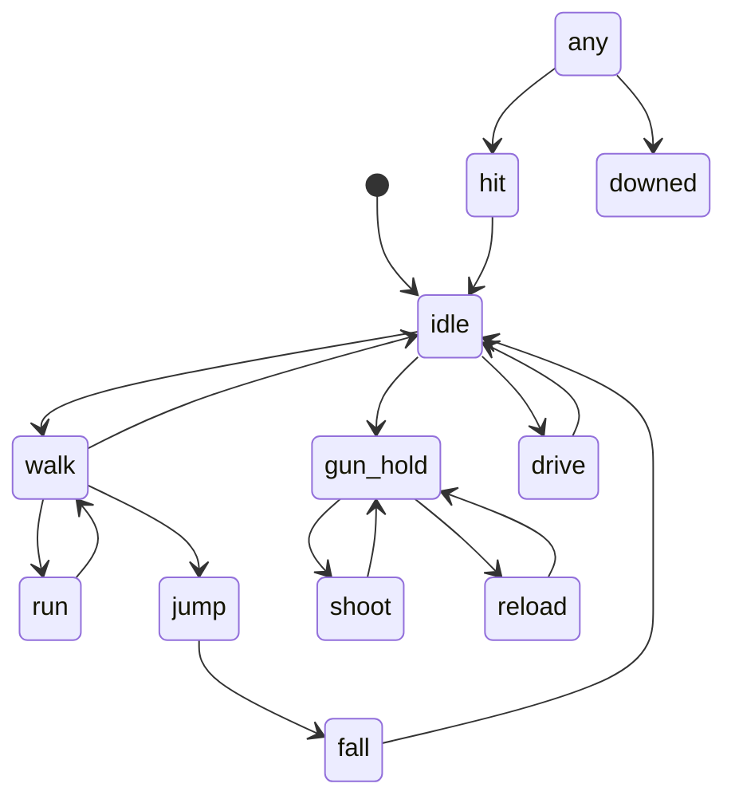

# Animation State Machine

Reference for the logical animation states used across **Zaylin's World** and how
they map to procedural poses today and to GLB clips as rigged characters land.

Implemented by [src/animation/animationStateMachine.js](../src/animation/animationStateMachine.js)
(`AnimationController`, `STATES`, `CLIP_ALIASES`, `TRANSITIONS`). That module is
**additive and not yet wired** into `updatePlayer()`, so it cannot regress the
existing procedural leg-swing. Adopt it per character incrementally.

---

## 1. State list

| State | Trigger (game logic) | Clip aliases (GLB) | Procedural fallback |
|-------|----------------------|--------------------|---------------------|
| `idle` | no input | idle, breathing, stand | neutral pose |
| `walk` | moving, not sprinting | walk, walking | leg/arm sin-swing (slow) |
| `run` | sprint + moving | run, jog, sprint | leg/arm sin-swing (fast) |
| `jump` | jump pressed, airborne up | jump | static crouch→extend |
| `fall` | airborne, vy < 0 | fall, air | tuck pose |
| `sit` | sitting on furniture | sit, seated | bent-hip pose |
| `drive` | in a vehicle | drive, sit | seated hands-forward |
| `punch` | unarmed attack | punch, jab | arm jab |
| `melee` | melee weapon swing | melee, swing, slash, bat | arm swing |
| `gun-hold` | firearm equipped | aim, gun, rifle, hold | arms raised holding weapon |
| `shoot` | firing | shoot, fire, shot | recoil nudge |
| `reload` | reloading | reload | hand-to-belt |
| `hit` | took damage | hit, flinch, hurt | flinch |
| `downed` | health 0 / KO | death, down, ko | ragdoll-lite collapse |
| `workout` | gym minigame | workout, pushup, lift | rep bob |
| `eat` | eating | eat, drink | hand-to-mouth |
| `fish` | fishing minigame | fish, cast, rod | cast + reel |
| `dance` | dance/audition | dance | bob/sway |
| `talk` | NPC dialogue | talk, wave, gesture | gesture |
| `swim` | in water | swim | stroke |

The table is mirrored exactly by `STATES` and `CLIP_ALIASES` in code — keep them
in sync.

---

## 2. Clip-name resolution

A logical state resolves to the **first** GLB clip whose name (case-insensitive)
contains any alias. This supports mixed naming schemes from different sources
(Mixamo `Walking`, RPM `M_Walk_001`, hand-authored `walk`) **without per-asset
config**. If no clip matches, `resolveClip()` returns `null` and the controller
leaves the GLB on its last pose while the procedural layer (or a future
procedural poser) handles that state.

---

## 3. Transitions



`TRANSITIONS` is **permissive by default** (unlisted target = allowed) and only
constrains the cases that would look wrong (e.g. you can't go straight from
`reload` into `swim`). `null` entries mean "interruptible from any state".

Per-state metadata (`STATE_META`) sets loop vs one-shot and cross-fade time:
one-shots (`shoot`, `reload`, `punch`, `jump`, `hit`, `eat`, `downed`) don't
loop and fade fast; locomotion states loop with a longer fade.

---

## 4. How placeholders get replaced

1. **Today:** characters are procedural; the controller records state and a
   subscriber (`onState`) can drive procedural posing. No clips required.
2. **Add a rigged GLB:** attach via `skinAvatar()`. If it carries clips,
   construct the controller with `{ mixer, clipNames }`; matching states now play
   real clips, unmatched states still fall back procedurally.
3. **Full clip set:** once a character has all clips, the procedural layer for
   that character becomes a pure safety net.

This lets the game ship now and upgrade fidelity per character with zero
breaking changes.

---

## 5. Usage sketch (when wiring begins)

```js
import { createAnimationController, STATES } from './animation/animationStateMachine.js';

// after building/ skinning a character:
const anim = createAnimationController({ mixer: avatar.skinMixer, clipNames: avatar.clipNames });

// each frame, from movement code:
anim.setLocomotion(currentSpeed);        // idle/walk/run by speed
if (firing) anim.set(STATES.SHOOT);
anim.update(dt);                          // ticks the GLB mixer (no-op if procedural)
```

> Adoption is deliberately incremental. Wire the **player first**, verify no
> regression to the existing leg-swing, then extend to NPCs/cops with a
> live-skinned cap for performance.
