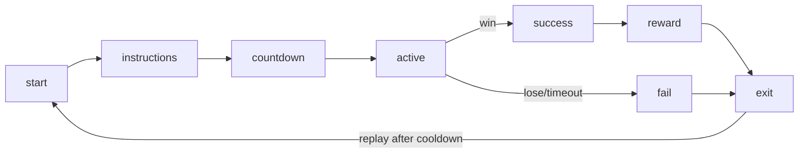

# Minigame Framework

A common lifecycle for every minigame in **Zaylin's World**, so new activities
(fishing, dungeon, obby, casino, coding, rhythm, gym, food) plug in consistently
and feel polished — not exposed placeholders.

Backing code/data (skeletons, **not yet wired** into gameplay):
- [src/config/minigameCatalog.js](../src/config/minigameCatalog.js) — registry of minigames
- [src/minigames/index.js](../src/minigames/index.js) — registration + lookup API
- [src/minigames/minigameRunner.js](../src/minigames/minigameRunner.js) — lifecycle driver

> The existing in-game `startTimingGame()` (clippers/gym/study) is the proven
> pattern this framework generalizes. The runner is additive and does not replace
> `startTimingGame` yet.

---

## 1. Lifecycle



| Phase | Responsibility |
|-------|----------------|
| `start` | gate entry (energy/money/permit), pick variant, set up state |
| `instructions` | one-screen how-to (skippable for repeats) |
| `countdown` | 3-2-1, lock input until go |
| `active` | core loop: input → score, timer, feedback, animation hooks |
| `success`/`fail` | resolve outcome, tally score |
| `reward` | apply money + `state.stats` deltas + items |
| `exit` | restore HUD/controls; respect a replay **cooldown** |

Every minigame declares these as data + a small `run` hook; the runner enforces
the shared flow (countdown, timer, results screen, cooldown) so each game only
implements its core loop.

---

## 2. Minigame descriptor shape

```js
{
  id: 'fishing',
  title: 'Cast & Reel',
  town: 'fishing-harbor',
  category: 'timing',            // timing | rhythm | puzzle | luck | platform | combat | driving
  entry: { energy: 5, money: 0, permit: 'fishing-permit' },
  duration: 30,                  // seconds (0 = until win/fail)
  cooldown: 8,                   // seconds before replay
  reward: { money: [40, 150], stat: { fun: 4 }, items: ['fish'] },
  instructions: 'Cast, wait for the bite, reel in the green zone.',
  run: 'fishingLoop',            // hook id resolved by the game when wired
}
```

Rewards map only onto the wallet + existing `state.stats`
({health, energy, fitness, hygiene, fun, smarts}) and item ids — no invented
stats. `reward.money` may be a `[min,max]` range scored by performance.

---

## 3. Required plans per minigame (no exposed placeholders)

Each new minigame must document, in its catalog entry or this file:
- **Asset plan** — models/textures/sounds (sourced via
  [ASSET_CREATION_WORKFLOW.md](ASSET_CREATION_WORKFLOW.md)).
- **Animation plan** — which `AnimationController` states it uses
  (see [ANIMATION_STATE_MACHINE.md](ANIMATION_STATE_MACHINE.md): `fish`, `dance`,
  `workout`, …).
- **Interaction plan** — controls + feedback.
- **UI plan** — instructions, timer, score, results.
- **Fallback plan** — what happens if an asset/clip is missing (procedural
  stand-in, never a broken screen).
- **Perf plan** — fits the budget in
  [GRAPHICS_ANIMATION_PIPELINE.md](GRAPHICS_ANIMATION_PIPELINE.md) §6.

---

## 4. Planned minigames

| Town | Minigames |
|------|-----------|
| Starter | clippers-lineup, gym-training, food-shift, driving |
| Fishing | fishing (cast/reel), fish-transform, crab-traps |
| Dungeon | dungeon-crawl, boss-fight |
| Obby | obby-course, time-trial |
| Casino | slots, blackjack, roulette, prize-wheel, arcade |
| Tech | coding-puzzle, drone-pilot, hacking |
| Hollywood | rhythm-audition, dance-battle, talk-show |
| Rich | golf, yacht-run, car-show |

---

## 5. Runner API (skeleton)

```js
import { registerMinigame, getMinigame, listMinigames } from './minigames/index.js';
import { MinigameRunner } from './minigames/minigameRunner.js';

const runner = new MinigameRunner({
  descriptor: getMinigame('gym-training'),
  hooks: {
    canStart: () => state.stats.energy >= 5,
    onActive: (ctx) => { /* per-frame core loop */ },
    onReward: (reward) => applyReward(reward),   // wallet + state.stats
  },
});
runner.start();   // drives instructions → countdown → active → results → cooldown
```

The runner is intentionally engine-agnostic and **not imported by the game yet**,
so adding it changes nothing at runtime. Wire the **gym** or **fishing** game
first (reusing the timing-game pattern), verify the shared flow, then port the
rest.
