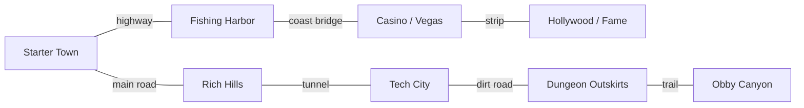

# World Map Design

The long-term vision for **Zaylin's World** as an **original** (non-GTA) connected
multi-town world. This document is design intent + the data shape that
[src/config/worldMapPlan.js](../src/config/worldMapPlan.js) expresses. The current
playable area (Starter Town) still uses [src/config/mapConfig.js](../src/config/mapConfig.js)
as its single source of truth — `worldMapPlan.js` is **forward-looking data, not
wired into gameplay**.

---

## 1. Vision

A stylized low-poly world of distinct **towns/districts** linked by a real road
network — highways, main roads, local streets, bridges, and dirt tracks — with
water, parks, and countryside between them. Each town has its own identity,
economy, services, missions, and minigames, so travel feels like moving between
places, not loading screens. Original IP: no real brands, no GTA assets.

---

## 2. Road hierarchy

| Tier | Role | Width | Speed feel | Notes |
|------|------|-------|-----------|-------|
| `highway` | inter-town, high speed | widest | fast | on/off ramps, no pedestrians |
| `main` | arterial within a town | wide | medium | traffic lights, bus stops |
| `local` | block streets | standard | slow | the Starter grid today |
| `bridge` | water/canyon crossing | varies | medium | rails, supports |
| `tunnel` | through hills | standard | medium | lit, enclosed |
| `dirt` | countryside/back roads | narrow | slow | dust, rough handling |
| `special` | strip/boardwalk/pier | varies | slow | pedestrian-heavy |

The Starter Town grid is the `local` tier of one district; higher tiers connect
districts together.

---

## 3. World structure

- **Districts:** each town is a district with a bounded local grid (reuse the
  `mapConfig` shape per town), an origin offset in world space, a theme, and a
  set of connection edges to neighbors.
- **Connections:** typed edges (`highway`/`bridge`/`tunnel`/`dirt`) with two
  endpoints (district + gateway node), travel time, and unlock conditions.
- **Landmarks:** named, enterable buildings per district (stores, services,
  mission hubs) — same concept as `LANDMARKS` in `mapConfig.js`.
- **Activity zones:** circular/rect regions that drive map icons and ambient
  behavior (fishing spot, race start, casino floor, park, job site).
- **Terrain features:** water bodies, parks, countryside, hills — for visuals,
  routing constraints, and minigame gating.

---

## 4. Minimap → expanded map evolution

Today there's a minimap ([src/minimap.js](../src/minimap.js)). The roadmap:

1. **Minimap (now):** local heading + nearby roads/markers.
2. **Pannable map:** open a full-screen map; pan + zoom levels.
3. **Labels & markers:** district names, landmark icons, job/mission markers,
   property markers, activity icons (⛽ fishing 🎣 casino 🎰 …).
4. **District bounds & route hints:** shaded district areas, suggested route to a
   selected marker, fast-travel nodes once unlocked.
5. **Legend & filters:** toggle marker categories (services, missions, jobs,
   collectibles).

Marker categories are defined as data so the same map widget renders every town.

---

## 5. How this stays non-breaking

- `worldMapPlan.js` is **pure data**, no `THREE` import, not imported by the
  engine yet. Adding it changes nothing at runtime.
- Starter Town keeps `mapConfig.js`. When a second district is built, its local
  grid is authored as its own `mapConfig`-shaped file and **referenced** from the
  world plan — the world plan never replaces a town's local source of truth.
- Connections/fast-travel are introduced behind a feature flag when the second
  playable district exists.

See [TOWN_ROADMAP.md](TOWN_ROADMAP.md) for per-town content.
