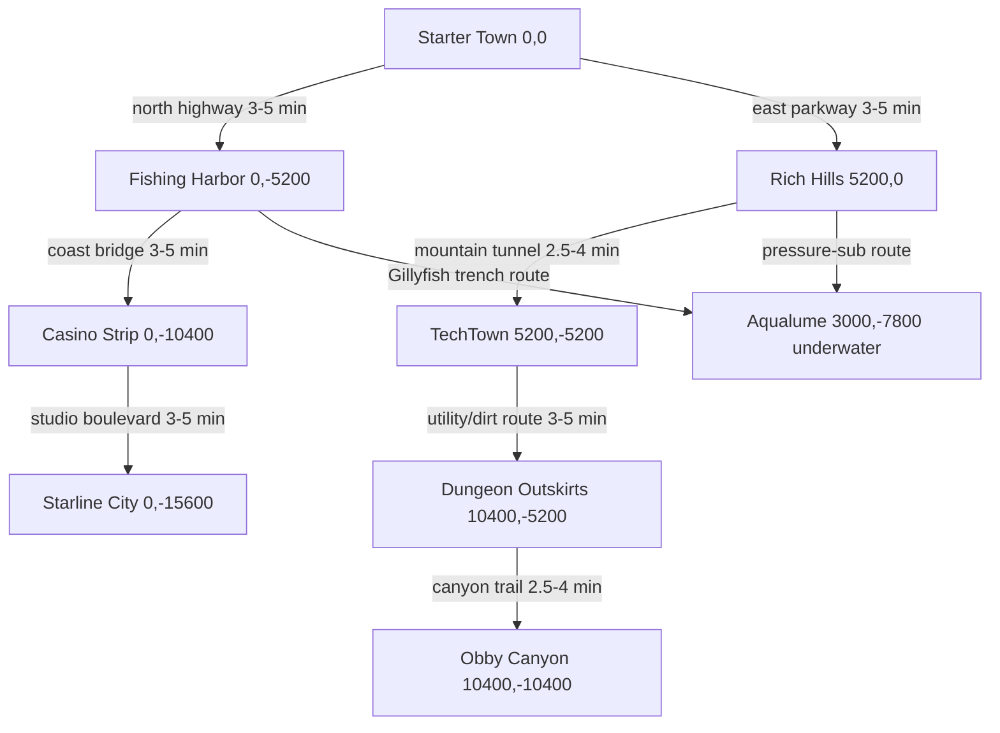

# World Map Design

Status: large-world planning specification  
Project: Zaylins Kid World, also called ZTA

This document describes the connected world expressed by
[src/config/worldMapPlan.js](../src/config/worldMapPlan.js). The current runtime still uses
[src/config/mapConfig.js](../src/config/mapConfig.js) for Starter Town, but the authoritative future scale is defined by
[LARGE_WORLD_SCALE_BLUEPRINT.md](LARGE_WORLD_SCALE_BLUEPRINT.md).

---

## 1. Vision

ZTA is a large stylized world containing cities/towns, districts, neighborhoods, countryside, highways, water, bridges, tunnels, trails, and underwater routes.

```txt
connected world
-> city/town
-> district
-> neighborhood/block
-> building, property, road, job, activity, service, or natural zone
```

Travel should feel physical. A player should spend real minutes driving across Starter Town and several minutes traveling between towns before unlocking optional fast travel.

Original IP rules remain unchanged: no copied real brands, maps, landmarks, or GTA assets.

---

## 2. Authoritative scale

Starter Town alone occupies:

```txt
playable footprint: 2,000 x 2,000
terrain envelope: about 2,400 x 2,400
```

Recommended connected-world envelope before later expansion:

```txt
about 22,000 units wide
about 20,000 units tall
plus water, underwater layers, and terrain buffers
```

Town centers are separated by thousands of units, not hundreds.

---

## 3. World layout


```mermaid
graph TD
    ST[Starter Town 0,0] -->|north highway 3-5 min| FH[Fishing Harbor 0,-5200]
    ST -->|east parkway 3-5 min| RH[Rich Hills 5200,0]
    RH -->|mountain tunnel 2.5-4 min| TC[TechTown 5200,-5200]
    FH -->|coast bridge 3-5 min| CS[Casino Strip 0,-10400]
    TC -->|utility/dirt route 3-5 min| DO[Dungeon Outskirts 10400,-5200]
    DO -->|canyon trail 2.5-4 min| OC[Obby Canyon 10400,-10400]
    CS -->|studio boulevard 3-5 min| SL[Starline City 0,-15600]
    FH -->|Gillyfish trench route| AQ[Aqualume 3000,-7800 underwater]
    RH -->|pressure-sub route| AQ
```

Aqualume occupies a vertically separate underwater layer inside Crownwater Basin and may overlap surface X/Z territory without being a surface collision conflict.

---

## 4. Route hierarchy

| Tier | Role | Typical use |
|---|---|---|
| `expressway` | fastest cross-city roads | Starter Beltway and major urban bypasses |
| `highway` | inter-town travel | Starter to Fishing Harbor |
| `parkway` | scenic/urban inter-town travel | Starter to Rich Hills |
| `main` | town arterial | district spines, traffic lights, bus stops |
| `local` | neighborhood streets | homes, schools, parks |
| `service` | deliveries and operations | warehouses, civic lots, backlots |
| `alley` | local shortcuts | deliveries and risky low-speed routes |
| `bridge` | water/canyon crossing | Fishing to Casino |
| `tunnel` | mountain/urban connection | Rich Hills to TechTown |
| `dirt` | rural/canyon route | Tech, Dungeon, Obby connections |
| `special` | themed boulevard/boardwalk | Casino to Starline |
| `water` | surface boat/yacht lanes | Crownwater Basin |
| `underwater` | swim/sub/current lanes | Aqualume access and city routes |

A repeated square loop is not a finished road network.

---

## 5. Town and district structure

Every town has:

- local bounds and terrain envelope
- multiple districts or equivalent geographic zones
- gateway nodes
- local road/path/water networks
- ordinary filler neighborhoods and infrastructure
- landmark buildings
- housing, school, jobs, services, law, and activities
- town-specific traffic, patrol, pedestrian, creature, or current behavior

Starter Town contains a historic Dreamdrop core inside a 2,000 x 2,000 city, not a single local grid treated as the entire world.

---

## 6. Inter-town corridors

Corridors are playable geography, not loading tubes.

They may contain:

- countryside
- farms or scattered homes
- fuel/service pull-offs
- bridges, tunnels, cliffs, and water views
- patrol/highway enforcement
- changing traffic density
- collectibles and hidden routes later
- lighting/weather transitions
- streaming checkpoints

The first trip must be physical. Fast travel may unlock only after discovery.

---

## 7. Streaming architecture

Large scale requires chunked loading.

Recommended default:

```txt
spatial cell: 250 x 250
high-detail active area: player cell plus neighboring 3 x 3
warm preload area: surrounding 5 x 5 where budget allows
far mode: terrain, skyline, major roads, and water only
```

Required systems:

- district/town activation
- chunk streaming and disposal
- LOD
- instanced filler buildings and vegetation
- pooled traffic/NPCs
- far skyline shells
- audio zones
- local simulation only near active routes
- persistent gameplay state independent from loaded visuals

---

## 8. Map UI evolution

Four map levels are required:

1. **Minimap:** immediate streets, nearby markers, active route.
2. **District map:** neighborhood and local activity detail.
3. **City map:** full town bounds, properties, schools, jobs, services, and routes.
4. **World map:** towns, inter-town corridors, water routes, unlocks, and travel gateways.

The map must support pan, zoom, filters, district labels, town silhouettes, route hints, and discovered fast-travel nodes.

---

## 9. Law and career geography

Criminal records and police-career eligibility are jurisdiction-specific. See
[POLICE_CAREER_SYSTEM.md](POLICE_CAREER_SYSTEM.md).

Each town has its own local authority and officer/ranger/warden/guard career. A conviction permanently closes that town's department but may allow a reformed player to apply in another jurisdiction.

---

## 10. Non-breaking implementation

- `worldMapPlan.js` remains pure forward-looking data until deliberately wired.
- Starter Town runtime remains on `mapConfig.js` until the large-road migration begins.
- Large scale is implemented behind staged systems: road segments, district chunks, map UI, then gateways.
- Old saves require a safe position migration when compact geometry is replaced.
- No connected town becomes playable until its local map source, streaming bounds, gateways, and return path are stable.

See:

- [LARGE_WORLD_SCALE_BLUEPRINT.md](LARGE_WORLD_SCALE_BLUEPRINT.md)
- [STARTER_TOWN_BLUEPRINT.md](STARTER_TOWN_BLUEPRINT.md)
- [TOWN_ROADMAP.md](TOWN_ROADMAP.md)
- [WORLD_BLUEPRINT_INDEX.md](WORLD_BLUEPRINT_INDEX.md)
